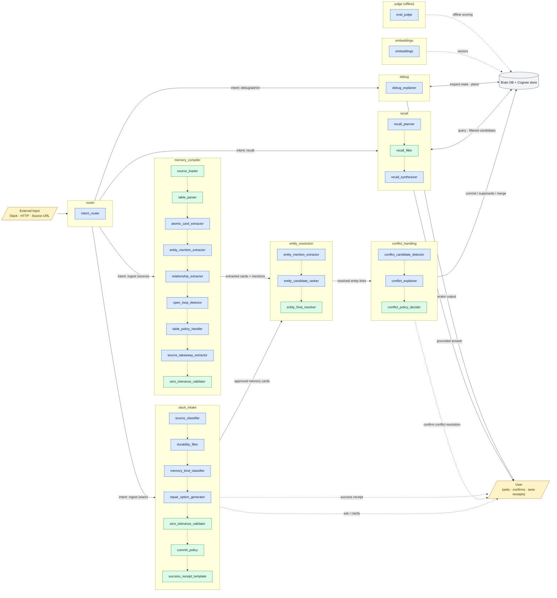

# Role Flow Diagram — Coarse & Fine-Grained Roles

This diagram shows how information and decisions flow through Brain's role
system. Each **coarse role** is a top-level capability (subgraph) composed of
**fine-grained roles** that either run an LLM (`model`) or apply policy
deterministically (`det`). The recurring pattern within every coarse role is:
model roles **recommend**, deterministic roles **validate / enforce**.

Source of truth: `brain_model_registry.yaml` (`fine_grained_capabilities`,
lines 71-145).

## Legend

- **model** (blue) — fine-grained role backed by an LLM
- **det** (green) — deterministic policy / validator
- **solid arrows** — primary information flow between coarse roles
- **dotted arrows** — internal ordering inside a coarse role
- **dashed arrows** — out-of-band / supporting roles

## End-to-end flow

## How to read this

1. **Router fans out.** The single LLM role `intent_router` decides whether
   the request is a Slack memory commit, a long-form source ingestion, a
   recall query, or a debug request, and dispatches accordingly.
2. **Ingestion paths converge.** Both `slack_intake` and `memory_compiler`
   produce candidate memory cards and entity mentions, which flow through
   `entity_resolution` and then `conflict_handling` before any write to the
   Brain DB / Cognee store.
3. **Model recommends, deterministic enforces.** Within each coarse role the
   dotted arrows show the order of execution: LLM-backed roles run first to
   propose extractions / classifications, and deterministic roles
   (`zero_tolerance_validator`, `commit_policy`, `entity_final_resolver`,
   `conflict_policy_decider`, `recall_filter`) gate the result before it
   leaves the coarse role.
4. **Recall reads, never writes.** `recall` queries the store, runs the
   deterministic `recall_filter` to drop deleted/superseded records, then
   `recall_synthesizer` produces the grounded answer.
5. **User loop.** The user is involved at three points: clarification
   (`repair_option_generator`), conflict confirmation, and final receipts /
   answers.
6. **Out-of-band.** `embeddings` supplies vectors to the store; `judge` runs
   offline against eval fixtures and is not on the runtime path.

## Coarse → fine-grained mapping (canonical)

| Coarse role        | Model roles                                                                                                                     | Deterministic roles                                                       |
| ------------------ | ------------------------------------------------------------------------------------------------------------------------------- | ------------------------------------------------------------------------- |
| router             | intent_router                                                                                                                   | —                                                                         |
| slack_intake       | source_classifier, durability_filter, memory_kind_classifier, repair_option_generator                                           | zero_tolerance_validator, commit_policy, success_receipt_template         |
| memory_compiler    | atomic_card_extractor, entity_mention_extractor, relationship_extractor, open_loop_detector, table_policy_handler, source_takeaway_extractor | table_parser, source_loader, zero_tolerance_validator         |
| entity_resolution  | entity_mention_extractor, entity_candidate_ranker                                                                               | entity_final_resolver                                                     |
| conflict_handling  | conflict_candidate_detector, conflict_explainer                                                                                 | conflict_policy_decider                                                   |
| recall             | recall_planner, recall_synthesizer                                                                                              | recall_filter                                                             |
| debug              | debug_explainer                                                                                                                 | —                                                                         |
| judge (offline)    | eval_judge                                                                                                                      | —                                                                         |
| embeddings         | embeddings                                                                                                                      | —                                                                         |
