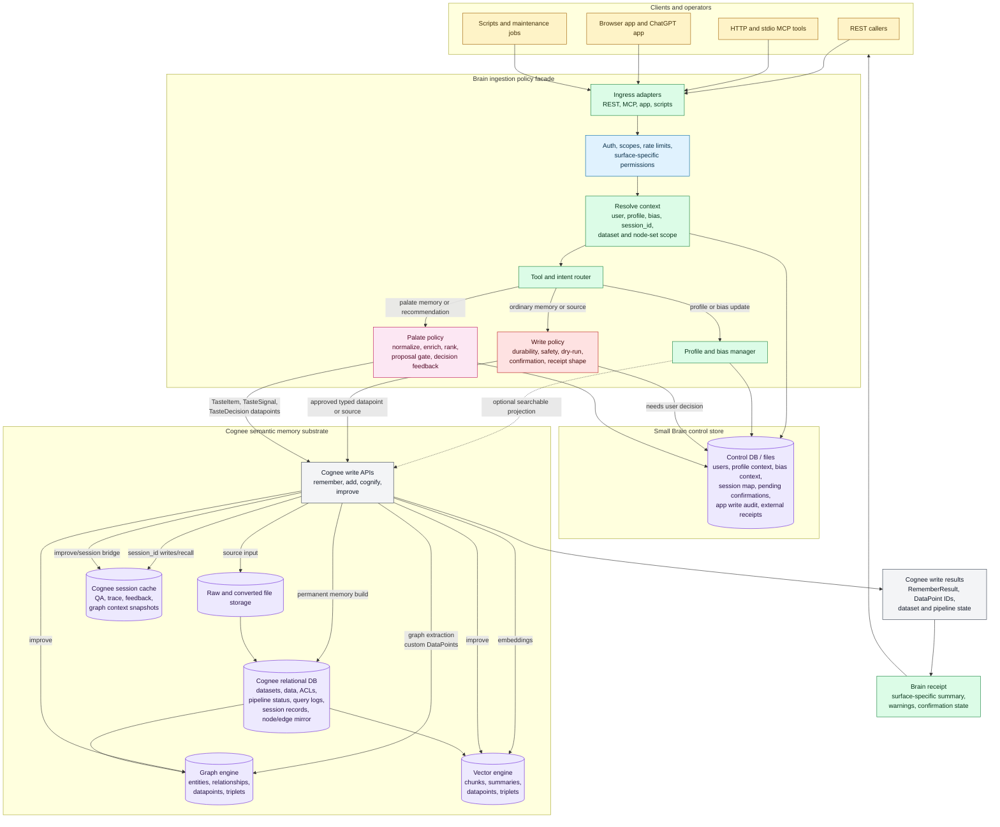
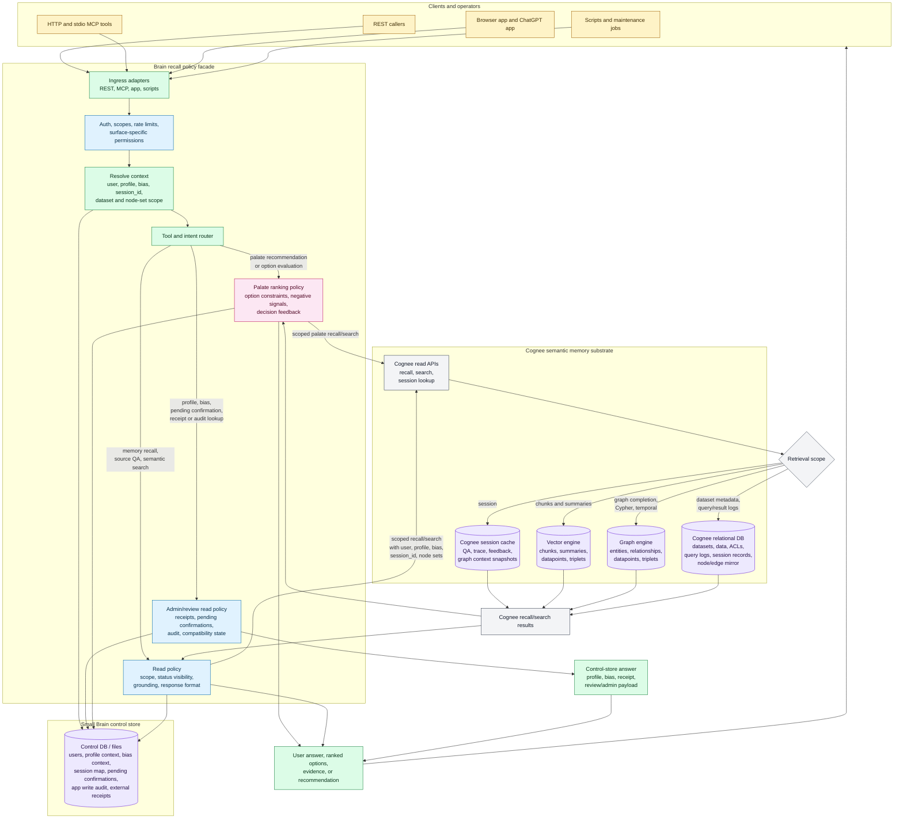

# Proposed Brain/Cognee Flow

This diagram shows the proposed narrower split after comparing Brain with Cognee's native information flow.

Brain becomes the policy, profile, bias, and session facade. Cognee becomes the canonical semantic memory substrate for durable memory, source ingestion, entity/relationship graph, vector retrieval, session memory, and graph improvement. Brain keeps only the control-plane state that Cognee does not model as application policy.

## Data Ingestion / Write Flow

## Data Recall / Read Flow

## Ownership Split

- **Brain owns context and policy:** user/session/profile resolution, bias context, app surface rules, dry-run and confirmation state, safety gates, response shape, app write audit, and user-visible maintenance decisions.
- **Cognee owns semantic memory:** source ingestion, dataset/data records, graph construction, vector indexing, entity/relationship retrieval, session cache, query logs, improvement, and deletion/reset of semantic memory.
- **Palate remains policy-heavy:** Brain keeps taste normalization, enrichment choices, ranking policy, option constraints, and decision feedback logic; Cognee stores/searches typed palate datapoints.
- **Profile and bias stay in Brain first:** They live in the control store because they shape routing and prompting. Brain can also project them to Cognee as typed datapoints when they should be semantically searchable.
- **No broad Brain memory mirror:** Brain should avoid rebuilding `memory_cards`, `entities`, `relationships`, source text storage, and broad recall logs as a second semantic database. Stable external IDs and receipts can be stored as lightweight control state or embedded in Cognee datapoints.

## Write Path

1. A client calls Brain through REST, MCP, the app, or a script.
2. Brain authenticates the caller and resolves user, profile, bias, session, dataset, and node-set scope.
3. Brain applies write policy. Uncertain or destructive writes become pending confirmations in the control store.
4. Approved ordinary memory/source writes go to Cognee as typed datapoints or source inputs.
5. Cognee stores the data, builds chunks, graph nodes/edges, summaries, embeddings, and queryable dataset state.
6. Brain returns a receipt shaped for the calling surface.

## Recall Path

1. Brain resolves profile, bias, session, and scope.
2. Brain chooses the read policy: direct control-store lookup, palate ranking, or Cognee recall/search.
3. Cognee returns semantic results from session cache, graph, vector, source chunks, summaries, or specialized retrievers.
4. Brain applies visibility, grounding, and response-format rules.
5. Brain returns an answer, evidence, receipt, or admin/review payload.

## Migration Direction

- Replace raw JSON text projection with typed Cognee datapoints for Brain memory, source chunks, profile context, open loops, status events, and palate records.
- Keep Brain control tables/files small and explicit: profile context, bias context, session map, pending confirmations, app write audit, and compatibility receipts.
- Move durable semantic state out of Brain's parallel `sources`, `memory_cards`, `entities`, `relationships`, `memory_links`, broad `ingestion_runs`, and broad `recall_logs` tables as migration allows.
