# Brain Flow Diagrams

This document contains two related but different views of Brain:

1. **Current runtime flow** - what the application code executes today.
2. **Fine-grained role topology** - the model/eval capability map used by the eval scorer and shared prompt contracts.

The fine-grained topology is useful for model evaluation and prompt-contract review, but it is not a literal runtime call graph. Current production runtime is mostly deterministic. The normal runtime LLM hooks are:

- an optional Slack proposal / repair model when `SlackMemoryAgent` is constructed with an injected `llm_client`
- an optional taste-routing / taste-proposal model when `BRAIN_TASTE_ENABLED=true`, the request is not marked to skip taste routing, and the taste branch is active
- an optional broad memory compiler fallback when `BRAIN_LLM_ENABLED=true` and deterministic rule compilation is not already high-confidence

`SlackMemoryAgent` and `compile_memory()` both load shared prompt-contract blocks from `src/memory_stack/agents/prompt_contracts.py` plus the role docs under `src/memory_stack/agents/shared/`. `SlackMemoryAgent` uses `prompt_contract_block(SLACK_RUNTIME_ROLES)`; `compile_memory()` uses `prompt_contract_block(MEMORY_COMPILER_RUNTIME_ROLES)`.

Slack and MCP are separate ingress paths, but they share the same core Brain service layer. Slack is not an MCP client.

The MCP surface exposes the public tools `brain_session`, `brain_remember`, `brain_profile_context_remember`, `brain_profile_context_list`, `brain_profile_context_forget`, `brain_app_data_controls`, `brain_ingest_source`, `brain_recall`, `brain_profile_entity`, `brain_list_open_loops`, `brain_get_memory`, `brain_review_recent`, `brain_undo_last`, `brain_agent_memory`, `brain_agent_memory_recall`, `brain_palate_describe_item`, `brain_palate_query`, `brain_palate_evaluate_options`, `brain_palate_confirm`, `brain_palate_cancel`, and `brain_palate_correct_proposal`. Internal admin MCP tools also include `brain_app_open_review_panel`, `brain_profile_context_sync`, `brain_get_source`, `brain_resolve_conflict`, `brain_forget`, `brain_merge_entities`, `brain_sync_cognee`, `brain_rebuild_cognee`, `brain_agent_memory_clear`, `cognee_improve`, `brain_palate_remember`, `brain_palate_log_decision`, and `brain_palate_refresh_enrichment`.

The main Brain HTTP surface includes root `/`, `/.well-known/oauth-authorization-server`, `/.well-known/oauth-protected-resource`, `/.well-known/oauth-protected-resource/{resource_path:path}`, `/.well-known/openid-configuration`, `/.well-known/openai-apps-challenge`, `authorize`, `api/session` and `auth/session`, `/account/password`, `/admin` and `/admin/users`, `/app`, `/app-assets/{asset_name}`, `/app/oauth/callback`, `/apple-touch-icon.png`, `/favicon.ico`, `/icon.png`, datasource routes (`/create_datasource`, `/datasources`, `/datasources/{datasource}`, `/delete_datasource`, `/delete_datasource/{datasource}`, `/list_datasources`), `/login`, `/logout`, `/register`, `/revoke`, `/token`, `/user`, `/memory/*` including `/memory/{memory_id}`, docs/openapi/redoc/privacy/support/terms, `/healthz`, and the catch-all MCP route `/{path:path}`. Slack has its own `/slack/commands`, `/slack/events`, `/slack/interactions`, and `/slack/healthz` ingress. Operational promotion and backups are handled outside this runtime flow by the release and deploy workflows; destructive operations remain guarded.

The shared agent rules also refuse secrets, passwords, API keys, tokens, private authentication material, and credential-shaped strings.

`remember()` can return a dry-run ingestion receipt when `request.dry_run` is set, and the service has background ingest helpers that can queue source ingestion work and return a queued receipt before the background future completes.

## Current Runtime Flow

Source of truth: `src/memory_stack/brain_service.py`, `src/memory_stack/brain_store.py`, `src/memory_stack/slack_memory_agent.py`, `src/memory_stack/route_logging.py`, `src/memory_stack/slack_guardrails.py`, `src/memory_stack/llm/client.py`, `src/memory_stack/taste/*`, `src/memory_stack/ingestion/*`, `src/memory_stack/resolution/*`, `src/memory_stack/recall/*`, `src/memory_stack/agents/prompt_contracts.py`, `src/memory_stack/agents/shared/*`, `src/memory_stack/agents/shared/memory_agent_rules.md`, and `src/memory_stack/agents/shared/agent_architecture.md`.

```mermaid
flowchart LR
    classDef det fill:#dcfce7,stroke:#15803d,color:#08331a;
    classDef opt fill:#e0f2fe,stroke:#0369a9,color:#082f49;
    classDef store fill:#f3f4f6,stroke:#374151,color:#111827;
    classDef ext fill:#fef3c7,stroke:#a16207,color:#3f2d05;

    USER[/User or client/]:::ext
    SLACK[/Slack commands<br/>events<br/>interactions/]:::ext
    HTTP[/HTTP routes<br/>OAuth discovery/protected-resource<br/>authorize and session endpoints<br/>login/logout/register/revoke/token<br/>admin/user · app/dashboard/assets/callback<br/>datasources · /memory/*<br/>docs/openapi/redoc/privacy/support/terms<br/>healthz · MCP catch-all/]:::ext
    DB[(Brain DB<br/>memory cards · sources · entities · relationships<br/>open loops · ingestion runs · recall logs · cognee sync)]:::store
    COGNEE[(Cognee projection)]:::store

    SLACK --> SAUTH[normalize request metadata]:::det
    SAUTH --> SPARSE[normalize text<br/>split intent]:::det
    SPARSE --> SREMEMBER[remember / confirm / cancel / correct / help / help_template]:::det
    SPARSE --> SREAD[recall / profile / open_loops / get_memory / review / undo_last]:::det

    SREMEMBER --> SPROPOSE[proposal + guardrails<br/>dry run + confirmation]:::det
    SPROPOSE -. optional injected LLM .-> SLLM[Slack proposal model]:::opt
    SPROPOSE --> REMEMBER[brain_service.remember]:::det

    REMEMBER --> TASTECHK[brain_taste_enabled and taste_skip check]:::det
    TASTECHK -. optional taste LLM .-> TLLM[Taste route model]:::opt
    TASTECHK -- palate branch --> TASTEPAL[classify_palate_memory_route]:::det
    TASTECHK -- normal branch --> TASTENORM[classify_taste_route]:::det
    TASTEPAL --> PALATEWRITE[TasteService remember / proposal]:::det
    TASTENORM --> COMPILE[compile_memory]:::det
    PALATEWRITE --> TASTEREC[return taste receipt or proposal]:::det

    HTTP --> HROUTE[FastAPI /memory/* endpoints<br/>MCP tool dispatch]:::det
    HROUTE --> REMEMBER
    HROUTE --> INGEST[brain_service.ingest_source]:::det
    HROUTE --> RECALL[brain_service.recall]:::det
    HROUTE --> PROFILE[brain_service.profile_entity]:::det
    HROUTE --> OPENLOOPS[brain_service.list_open_loops]:::det
    HROUTE --> GETMEM[brain_service.get_memory]:::det
    HROUTE --> REVIEW[brain_service.review_recent]:::det
    HROUTE --> UNDO[brain_service.undo_last]:::det
    HROUTE --> ADMIN[admin / memory tools<br/>get_source · profile_entity · review_recent<br/>open_loops · merge_entities · resolve_conflict<br/>undo_last · forget · sync_cognee · rebuild_cognee<br/>profile-context helpers · agent_memory · agent_memory_recall · agent_memory_clear<br/>palate tools]:::det

    INGEST --> TOREMEMBER[build RememberRequest]:::det
    TOREMEMBER --> REMEMBER

    COMPILE --> RULES[rule_compiler<br/>classify + create candidates]:::det
    RULES -. if enabled and rules are not high-confidence .-> CLLM[broad LLM compiler fallback]:::opt
    RULES --> RUN[create ingestion run]:::det
    CLLM --> RUN

    RUN --> UPSOURCE[upsert source<br/>mark Cognee pending]:::det
    RUN --> UPMEM[upsert memory card]:::det
    UPMEM --> ENT[resolve + link entities]:::det
    ENT --> REL[create relationships<br/>open loops]:::det
    REL --> CONFLICT[detect/apply duplicate<br/>supersession/conflict rules]:::det
    CONFLICT --> PENDING[mark Cognee pending/stale<br/>finish run + receipt]:::det
    UPSOURCE --> DB
    PENDING --> DB
    PENDING -. out-of-band sync .-> COGNEE

    SREAD --> RECALL
    SREAD --> PROFILE
    SREAD --> OPENLOOPS
    SREAD --> GETMEM
    SREAD --> REVIEW
    SREAD --> UNDO

    RECALL --> MODE[infer recall mode]:::det
    MODE --> RETRIEVE[search Brain DB<br/>optional Cognee hydration]:::det
    COGNEE -. optional hydration .-> RETRIEVE
    RETRIEVE --> FILTER[status visibility filter]:::det
    FILTER --> ANSWER[build facts/evidence<br/>render templated answer]:::det
    ANSWER --> DBLOG[log recall]:::det
    DBLOG --> DB
    ANSWER --> USER

    PROFILE --> USER
    OPENLOOPS --> USER
    GETMEM --> USER
    REVIEW --> USER
    UNDO --> USER

    ADMIN --> DB
    ADMIN -. sync/rebuild .-> COGNEE
```

## Runtime Notes

1. **Routing is deterministic.** HTTP requests are dispatched by FastAPI routes and MCP tool names. Slack requests arrive through `/slack/commands`, `/slack/events`, `/slack/interactions`, and `/slack/healthz`, then are dispatched by `SlackMemoryAgent` command parsing. The runtime does not call a fine-grained `intent_router` model.
2. **Slack command parsing includes repair, review, and undo paths.** `SlackMemoryAgent.handle()` normalizes text with `normalize_agent_text()`, splits intent with `split_intent()`, and dispatches commands such as `help_template`, `help`, `remember`, `confirm`, `cancel`, `correct`, `recall`, `profile`, `open_loops`, `open`, `get_memory`, `review`, and `undo_last`.
3. **Taste is a separate optional remember branch.** When `BRAIN_TASTE_ENABLED` is on and the request is not marked to skip taste routing, `remember()` may classify the input with taste routing before memory compilation. If `context.palate` is true, it uses `classify_palate_memory_route()`. In that branch, a `taste` remember request with confidence at or above `BRAIN_TASTE_AUTO_WRITE_THRESHOLD` can commit through `TasteService.remember()`. Otherwise it creates a proposal from text with `forced_palate` metadata and returns a dry-run `taste_proposal` receipt with `taste.requires_confirmation=true`. In the normal branch, `classify_taste_route()` is used; a `taste` remember request can auto-write at or above `BRAIN_TASTE_AUTO_WRITE_THRESHOLD`, and it can return a proposal when confidence reaches `BRAIN_TASTE_CONFIRMATION_THRESHOLD`.
4. **Compilation is deterministic first.** `compile_memory()` calls the rule compiler first. A broad LLM compiler can run only when `BRAIN_LLM_ENABLED` is on, a client is available, and the rule result is not already sufficient high-confidence. If a caller injects an `llm_client` and the fallback fails, the exception is re-raised; otherwise the rule result is returned.
5. **Fine-grained extractor roles are not separate runtime calls.** Roles such as `atomic_card_extractor`, `entity_mention_extractor`, `relationship_extractor`, `open_loop_detector`, `table_policy_handler`, and `source_takeaway_extractor` are currently represented by deterministic rule compiler behavior, or by the optional broad compiler fallback.
6. **Memory cards are written before conflict handling.** Runtime writes the memory card, resolves and links entities, creates relationships and open loops, then runs deterministic duplicate, conflict, and supersession handling.
7. **Recall and related read paths are deterministic.** Recall mode inference, retrieval, status filtering, evidence construction, and answer rendering are code paths, not a fine-grained `recall_synthesizer` model call. `profile_entity`, `list_open_loops`, `get_memory`, `review_recent`, and `undo_last` also remain service-layer read/maintenance calls rather than model-backed reasoning loops.
8. **Background ingest helpers exist.** The service can queue ingestion work onto a thread pool and return a queued ingestion receipt before the background future completes. `remember()` also returns a dry-run ingestion receipt when `request.dry_run` is set. Those queued and dry-run receipts are distinct from the normal compiled write path.
9. **Slack provenance belongs in request context metadata.** Team id, channel id, user id, thread timestamp, message timestamp, and permalink belong in Brain request context metadata, not in the memory statement itself.
10. **Eval and embeddings remain model-backed outside this flow.** `eval_judge` is used by eval tooling. Embedding models are used when vector/Cognee paths are enabled.
11. **MCP tools remain high-level service calls.** Public tools expose session, profile-context helpers, app data controls, memory ingest, recall, profile, open loops, memory lookup, review, undo, agent memory, and palate flows. Internal admin tools add review-panel, source inspection, conflict resolution, merge, forget, sync/rebuild, agent-memory clear, and palate management flows. `brain_undo_last` is a soft-delete path; hard delete remains guarded. These are service-layer entry points, not low-level storage APIs.

## Runtime Role Status

The table below describes current runtime behavior, not eval-topology intent.

| Role | Current runtime status |
| --- | --- |
| `intent_router` | Deterministic route and command parsing from FastAPI routes, MCP tool names, and Slack command parsing |
| `source_classifier` | Deterministic heuristics |
| `durability_filter` | Deterministic guardrails / rule sufficiency |
| `memory_kind_classifier` | Deterministic classification |
| `repair_option_generator` | Default deterministic; only model-based if an injected Slack LLM client is provided |
| `commit_policy_decider` | Deterministic backend validation and explicit user action; not a normal runtime model call |
| `success_receipt_generator` | Deterministic receipt assembly from backend receipt data; not a normal runtime model call |
| `atomic_card_extractor` | Deterministic rule compiler by default; optional broad compiler LLM fallback, not a separate role |
| `entity_mention_extractor` | Deterministic from compiled card entities by default; optional broad compiler fallback |
| `relationship_extractor` | Deterministic from rule compiler by default; optional broad compiler fallback |
| `open_loop_detector` | Deterministic rules |
| `table_policy_handler` | Deterministic table handling |
| `source_takeaway_extractor` | Deterministic source summary/card creation by default; optional broad compiler fallback |
| `source_loader` | Deterministic source loading and fetch-status handling; not a normal model call |
| `zero_tolerance_validator` | Deterministic hard gate before writes |
| `entity_candidate_ranker` | Not a runtime model role; entity resolution is deterministic |
| `entity_final_resolver` | Deterministic at current runtime; semantic final resolution is represented in the fine-grained role topology |
| `conflict_candidate_detector` | Deterministic duplicate / conflict detection |
| `conflict_explainer` | Not model-backed at runtime |
| `conflict_policy_decider` | Deterministic code / explicit user action at current runtime; decision flow is represented in the fine-grained role topology |
| `recall_planner` | Deterministic mode inference |
| `recall_relevance_filter` | Deterministic retrieval/filtering at current runtime; model-backed only in eval topology |
| `recall_synthesizer` | Deterministic templated rendering |
| `debug_explainer` | Deterministic DB inspection at runtime |
| `eval_judge` | Model-based in eval tooling only |
| `embeddings` | Embedding-model based when vector/Cognee paths are used |

## Fine-Grained Role Topology

### Legend

- **model** (blue) - fine-grained role backed by an LLM
- **det** (green) - deterministic policy / validator
- **solid arrows** - intended information flow between coarse capabilities
- **dotted arrows** - intended ordering inside a coarse capability
- **dashed arrows** - out-of-band / supporting roles

Source of truth: `src/memory_stack/evals/scoring.py` (`COARSE_CAPABILITIES`) and shared prompt-contract docs under `src/memory_stack/agents/shared/`. Runtime prompt bundles are `SLACK_RUNTIME_ROLES` and `MEMORY_COMPILER_RUNTIME_ROLES`.

```mermaid
flowchart TD
    classDef model fill:#dbeafe,stroke:#1d4ed8,color:#0b1f4a;
    classDef det   fill:#dcfce7,stroke:#15803d,color:#08331a;
    classDef gate  fill:#fef9c3,stroke:#a16207,color:#3f2d05;
    classDef store fill:#f3f4f6,stroke:#374151,color:#111827;
    classDef ext   fill:#fef3c7,stroke:#a16207,color:#3f2d05;
    classDef out   fill:#fee2e2,stroke:#b91c1c,color:#450a0a;

    USER[/User or client/]:::ext
    INPUT[/Slack message<br/>HTTP tool<br/>source payload<br/>recall or debug request/]:::ext
    DB[(Brain DB<br/>memory cards · entities · conflicts · recall logs)]:::store
    COGNEE[(Cognee/vector projection)]:::store

    USER --> INPUT

    subgraph ROUTER[router]
        direction TB
        IR[intent_router<br/>Classify the request as remember, source ingest, recall, debug/admin, judge/eval, or unsupported.<br/>Does not write memory or answer recall.]:::model
        INTENT{Intent?}:::gate
        IR --> INTENT
    end

    INPUT --> IR

    INTENT -- remember / Slack intake --> SC
    INTENT -- source ingest / document --> SL
    INTENT -- recall question --> RP
    INTENT -- debug/admin --> DX
    INTENT -- eval/offline judgement --> EJ
    INTENT -- unsupported / unsafe --> UNSUP[Reject or ask for supported request]:::out

    subgraph SLACK[slack_intake logical flow]
        direction TB
        SC[source_classifier<br/>Decide whether the input is a direct memory request, source material, recall/debug request, repair interaction, or noise.]:::model
        SOURCE_KIND{Source class?}:::gate
        DF[durability_filter<br/>Check whether there is durable, personal, specific information worth storing.]:::model
        DURABLE{Durable value?}:::gate
        MK[memory_kind_classifier<br/>Assign the candidate kind: preference, family_fact, routine, person_interaction, project_state, open_question, source_summary, etc.]:::model
        RG1[repair_option_generator<br/>Create user-facing choices when the candidate is ambiguous, too vague, unsafe, duplicated, or needs confirmation.]:::model
        CP[commit_policy_decider<br/>Choose commit, ask/needs_confirmation, reject/do_not_store, duplicate handling, or repair path using validator/conflict/entity status.]:::model
        COMMIT{Commit policy?}:::gate
        ZTV1[zero_tolerance_validator<br/>Hard deterministic guard: block unresolved pronouns, entity overmerge, no-durable junk, prompt injection, silent overwrite, and unsafe writes.]:::det
        SR[success_receipt_generator<br/>Generate a grounded receipt only from backend receipt data: stored IDs, kinds, confidence/status, actions, warnings.]:::model

        SC --> SOURCE_KIND
        SOURCE_KIND -- memory candidate --> DF
        SOURCE_KIND -- source/document/table --> SL
        SOURCE_KIND -- recall/debug --> IR
        SOURCE_KIND -- noise or unsupported --> RG1
        DF --> DURABLE
        DURABLE -- yes --> MK
        DURABLE -- no / vague / unsafe --> RG1
        MK --> CP
        RG1 --> CP
        CP --> COMMIT
        COMMIT -- commit allowed --> ZTV1
        COMMIT -- ask / needs_user_choice --> ASK1[Ask user with repair or confirmation options]:::out
        COMMIT -- reject / do_not_store --> NOSTORE[Do not write; explain why]:::out
        COMMIT -- duplicate --> DUP[Do not create duplicate; link or report existing memory]:::out
        ZTV1 -- passes --> EME1
        ZTV1 -- blocks --> RG1
        SR --> RECEIPT[Receipt to user]:::out
    end

    subgraph COMPILER[memory_compiler logical flow]
        direction TB
        SL[source_loader<br/>Load source text, metadata, URL/PDF/chat/table payloads, and fetch status.]:::det
        LOAD_OK{Source loaded?}:::gate
        TP[table_policy_handler<br/>Decide whether tabular input is small enough to summarize/extract or too large and should remain source data.]:::model
        TABLE_KIND{Table/source policy?}:::gate
        ST[source_takeaway_extractor<br/>Extract source-level takeaways while preserving the source-memory split.]:::model
        ACE[atomic_card_extractor<br/>Extract small, durable, traceable memory candidates rather than one giant card.]:::model
        EME2[entity_mention_extractor<br/>Extract entity mentions from source-derived cards.]:::model
        RE2[relationship_extractor<br/>Extract explicit relationships such as daughter_of, twin_of, likes, works_at, associated_with.]:::model
        OLD[open_loop_detector<br/>Detect open questions, pending tasks, follow-ups, and unresolved source loops.]:::model
        ZTV2[zero_tolerance_validator<br/>Block prompt-injection obedience, giant source-as-memory cards, unsafe source writes, and dropped table values.]:::det

        SL --> LOAD_OK
        LOAD_OK -- loaded text/table --> TP
        LOAD_OK -- fetch failed / URL only --> ST
        TP --> TABLE_KIND
        TABLE_KIND -- small table --> ACE
        TABLE_KIND -- large table/source only --> ST
        TABLE_KIND -- not table --> ACE
        ST --> ACE
        ACE --> EME2
        EME2 --> RE2
        RE2 --> OLD
        OLD --> ZTV2
        ZTV2 -- passes --> EME1
        ZTV2 -- blocks --> RG1
    end

    subgraph ENTITY[entity_resolution logical flow]
        direction TB
        EME1[entity_mention_extractor<br/>Normalize mentions and surface candidate referents from memory cards/source text.]:::model
        HAS_MENTION{Entity mention present?}:::gate
        ECR[entity_candidate_ranker<br/>Rank supplied candidates only when alias/context distinguishes one; preserve ambiguity for shared names or aliases.]:::model
        CANDIDATE{Candidate evidence?}:::gate
        EFR[entity_final_resolver<br/>Return use_existing, create_new, ambiguous, needs_clarification, or needs_user_choice with confidence and reason.]:::model
        ENTITY_ACTION{Entity action?}:::gate

        EME1 --> HAS_MENTION
        HAS_MENTION -- no entity needed --> CCD
        HAS_MENTION -- mentions found --> ECR
        ECR --> CANDIDATE
        CANDIDATE -- clear alias/context match --> EFR
        CANDIDATE -- no candidate / new entity --> EFR
        CANDIDATE -- ambiguous shared name/alias --> EFR
        EFR --> ENTITY_ACTION
        ENTITY_ACTION -- use_existing --> LINK_EXISTING[Link existing entity ID]:::det
        ENTITY_ACTION -- create_new --> CREATE_ENTITY[Create entity record]:::det
        ENTITY_ACTION -- ambiguous / needs_clarification / needs_user_choice --> ASK_ENTITY[Ask user to choose entity; no overmerge]:::out
        LINK_EXISTING --> CCD
        CREATE_ENTITY --> CCD
    end

    subgraph CONFLICT[conflict_handling logical flow]
        direction TB
        CCD[conflict_candidate_detector<br/>Compare proposed/current memory against existing records and classify none, duplicate, additive, supersedes, contradicts, correction, or ambiguous conflict.]:::model
        CONFLICT_KIND{Conflict candidate?}:::gate
        CE[conflict_explainer<br/>Explain the conflict, evidence, affected memory, and safe action space without choosing an unsafe mutation.]:::model
        CPD[conflict_policy_decider<br/>Choose keep_both, mark_duplicate, ask_user, reject, or supersede only when explicit confirmation/safe action exists.]:::model
        POLICY{Conflict policy?}:::gate

        CCD --> CONFLICT_KIND
        CONFLICT_KIND -- none --> WRITE_NEW
        CONFLICT_KIND -- additive --> WRITE_NEW
        CONFLICT_KIND -- duplicate --> CE
        CONFLICT_KIND -- supersedes / contradicts / correction --> CE
        CONFLICT_KIND -- ambiguous identity/context --> CE
        CE --> CPD
        CPD --> POLICY
        POLICY -- keep_both --> WRITE_NEW[Write new current memory]:::det
        POLICY -- mark_duplicate --> MARK_DUP[Do not create duplicate; link/report duplicate]:::det
        POLICY -- ask_user --> ASK_CONFLICT[Ask user before overwrite/supersession]:::out
        POLICY -- reject --> REJECT_CONFLICT[Reject unsafe conflicting candidate]:::out
        POLICY -- supersede with explicit confirmation --> SUPERSEDE[Mark old superseded; write replacement]:::det
    end

    WRITE_NEW --> DB
    MARK_DUP --> DB
    SUPERSEDE --> DB
    DB --> SR

    subgraph RECALL[recall logical flow]
        direction TB
        RP[recall_planner<br/>Convert a recall question into retrieval scope, query terms, entity filters, and requested answer shape.]:::model
        RET[Backend retrieval<br/>Search Brain DB and optional Cognee/vector projection.]:::det
        VIS[Status visibility gate<br/>Remove deleted/superseded/private-out-of-scope records before model relevance.]:::det
        RRF[recall_relevance_filter<br/>Keep only memories relevant to the query; exclude stale, deleted, superseded, irrelevant, or scope-leaking records.]:::model
        ANY_RECALL{Relevant evidence?}:::gate
        RS[recall_synthesizer<br/>Produce a grounded answer from retained evidence with citations and absence caveats.]:::model

        RP --> RET
        RET --> VIS
        VIS --> RRF
        RRF --> ANY_RECALL
        ANY_RECALL -- yes --> RS
        ANY_RECALL -- no --> NO_EVIDENCE[Answer with scoped absence / no current evidence]:::out
    end

    DB --> RET
    COGNEE -. optional vector hydration .-> RET
    RS --> USER
    NO_EVIDENCE --> USER

    subgraph DEBUG[debug/admin]
        DX[debug_explainer<br/>Explain stored state, conflicts, recall evidence, policy decisions, and admin/debug outputs without mutating memory unless an admin tool explicitly does so.]:::model
    end

    DX <--> DB
    DX --> USER

    subgraph JUDGE[offline eval/judge]
        EJ[eval_judge<br/>Score model outputs against fixtures for quality, safety, grounding, and role contract adherence.]:::model
    end

    EJ -. offline only .-> DB
    EMB[embeddings<br/>Generate vectors for retrieval/projection paths when enabled.]:::model
    EMB -. vectors .-> COGNEE
    DB -. projection sync .-> COGNEE
```

### How to Read the Topology

1. **This is an eval/runtime role-contract topology with explicit logical branches.** It shows how model roles compose in shared prompt contracts. It is not the exact current runtime call graph.
2. **Decision roles are shown as conditionals.** For example, `conflict_candidate_detector` does not just pass data downstream: it chooses between no conflict, additive, duplicate, supersession/contradiction, and ambiguous identity/context. Each choice changes the next action.
3. **Safety gates remain deterministic.** Model roles may propose semantic classifications and policies, but zero-tolerance validators, status visibility filters, and backend writes remain hard code gates.
4. **Ingestion paths converge before entity and conflict handling.** Slack intake and source compilation both produce candidate cards and mentions. Those candidates must pass entity resolution before conflict policy can decide whether anything is written.
5. **Ask/reject paths are first-class outputs, not errors.** Ambiguity, no-durable-value input, unsafe conflicts, and entity uncertainty should flow to user clarification or rejection rather than being forced into a write.
6. **Recall has two safety layers.** Backend status visibility removes deleted or superseded records before `recall_relevance_filter`; the relevance role then prunes semantically irrelevant records before synthesis.
7. **Out-of-band roles are separate.** `eval_judge` scores fixtures offline, and `embeddings` supplies vector/projection data. Neither owns normal memory write policy.
8. **Prompt contracts mirror the runtime bundles.** The Slack intake flow and the compiler flow both share the prompt-contract blocks used by the tests, so the topology should stay aligned with `SLACK_RUNTIME_ROLES`, `MEMORY_COMPILER_RUNTIME_ROLES`, and the shared role docs.

### Fine-Grained Role Function Reference

| Role | Function | Main inputs | Main outputs / branches |
| --- | --- | --- | --- |
| `intent_router` | Route the input to the correct workflow without doing downstream work. | User text, command/tool metadata, source/debug context. | remember, source ingest, recall, debug/admin, eval/judge, unsupported. |
| `source_classifier` | Distinguish memory candidate, source/document, recall/debug request, repair interaction, or noise. | Slack/user input and command context. | memory candidate to durability; source to compiler; recall/debug back to router; noise to repair/reject. |
| `durability_filter` | Decide whether a candidate contains durable, specific personal memory value. | Candidate text, source context, validator hints. | durable to kind classification; not durable/vague/unsafe to repair or reject. |
| `memory_kind_classifier` | Assign the memory kind used by downstream validators and receipts. | Durable candidate text and context. | preference, family_fact, routine, person_interaction, project_state, open_question, source_summary, etc. |
| `repair_option_generator` | Produce user-facing repair or confirmation options for non-committable candidates. | Validator failures, ambiguity, low confidence, conflict/entity status. | ask/clarify choices, rewrite prompts, reject explanation, conflict/entity buttons. |
| `commit_policy_decider` | Decide whether a validated proposal may be committed. | Candidate, kind, durability, validator status, entity/conflict status, confirmation state. | commit; ask/needs_confirmation; reject/do_not_store; duplicate handling; repair path. |
| `success_receipt_generator` | Generate a grounded receipt after backend write results exist. | Backend ingestion receipt: memory IDs, source IDs, kinds, confidence/status, actions, warnings. | receipt text and included IDs, or not stored/cannot confirm when receipt data is absent. |
| `atomic_card_extractor` | Extract small durable memory cards from source/input. | Source text, table text, chat transcript, direct memory text. | candidate cards, source references, confidence; rejects giant source-as-memory cards. |
| `entity_mention_extractor` | Extract and normalize entity mentions from candidate cards/source text. | Candidate cards, source text, existing context. | normalized mentions for candidate ranking, or no-entity-needed. |
| `relationship_extractor` | Extract explicit relationships attached to memory cards. | Candidate cards and entity mentions. | relationship edges such as daughter_of, twin_of, likes, works_at, associated_with. |
| `open_loop_detector` | Detect questions, pending tasks, and follow-up loops. | Candidate cards/source text. | open_loop cards or no open loop. |
| `table_policy_handler` | Decide how tabular input should be handled. | Table shape, row count, source context. | small table to extraction; large table/source-only handling; no-table pass-through. |
| `source_loader` | Load source payloads and preserve fetch/status metadata. | URL, PDF, chat transcript, pasted text, metadata. | loaded source candidate, fetch-failure note, or raw source text for downstream extraction. |
| `source_takeaway_extractor` | Extract source-level takeaways while preserving source-memory boundaries. | Loaded source text, fetch status, URL/PDF/chat/table metadata. | source summary/takeaways, source-only warning, or fetch-failure note. |
| `entity_candidate_ranker` | Rank candidate entities only when evidence distinguishes one candidate. | Entity mention, candidate list, aliases, types, context. | ranked candidate/use_existing evidence; ambiguous/shared-name result; no candidate/new entity path. |
| `entity_final_resolver` | Make the final entity action safely. | Mention, candidate ranking, aliases, IDs, contextual evidence. | use_existing, create_new, ambiguous, needs_clarification, needs_user_choice. |
| `conflict_candidate_detector` | Decide whether proposed memory conflicts with existing memory. | Proposed card, resolved entities, existing current/superseded records. | none, additive, duplicate, supersedes, contradicts, correction, ambiguous identity/context. |
| `conflict_explainer` | Explain detected conflict and safe action space. | Conflict candidate, affected memory, evidence, confidence. | conflict explanation, target memory context, allowed actions; no mutation. |
| `conflict_policy_decider` | Choose final conflict policy without silent overwrite. | Conflict explanation, allowed actions, confirmation state. | keep_both, mark_duplicate, ask_user, reject, or explicit-confirmed supersede. |
| `recall_planner` | Convert recall question into retrieval plan. | User query, requested scope, entity hints. | query terms, filters, answer shape, not-a-recall boundary. |
| `recall_relevance_filter` | Prune retrieved candidates after backend status visibility gates. | Query, current candidates, excluded/deleted/superseded markers. | included memory IDs, excluded IDs/reasons, no relevant evidence. |
| `recall_synthesizer` | Produce final grounded recall answer. | Filtered evidence and citations. | grounded answer with citations, or scoped absence/no-current-evidence answer. |
| `debug_explainer` | Explain state and admin/debug evidence. | DB state, run IDs, policy decisions, recall evidence, operator query. | diagnostic explanation, safe inspect output, no normal memory mutation. |
| `eval_judge` | Score model outputs offline. | Fixture prompt, expected contract, candidate output. | pass/fail/score/rationale for eval tooling only. |
| `embeddings` | Generate vector representations for retrieval/projection. | Text chunks/cards/source data. | vectors in Cognee/vector projection, not policy decisions. |

### Coarse → fine-grained mapping (canonical)

| Coarse role | Model roles | Deterministic roles |
| --- | --- | --- |
| router | intent_router | — |
| slack_intake | source_classifier, durability_filter, memory_kind_classifier, repair_option_generator, commit_policy_decider, success_receipt_generator | zero_tolerance_validator |
| memory_compiler | atomic_card_extractor, entity_mention_extractor, relationship_extractor, open_loop_detector, table_policy_handler, source_takeaway_extractor | source_loader, zero_tolerance_validator |
| entity_resolution | entity_mention_extractor, entity_candidate_ranker, entity_final_resolver | — |
| conflict_handling | conflict_candidate_detector, conflict_explainer, conflict_policy_decider | — |
| recall | recall_planner, recall_relevance_filter, recall_synthesizer | — |
| debug | debug_explainer | — |
| judge (offline) | eval_judge | — |
| embeddings | embeddings | — |

<!-- brain-doc-source-hash: 7423762128385715bc4ec9e166038ffeecae760aa34961dd012367fa2c750ff8 -->
