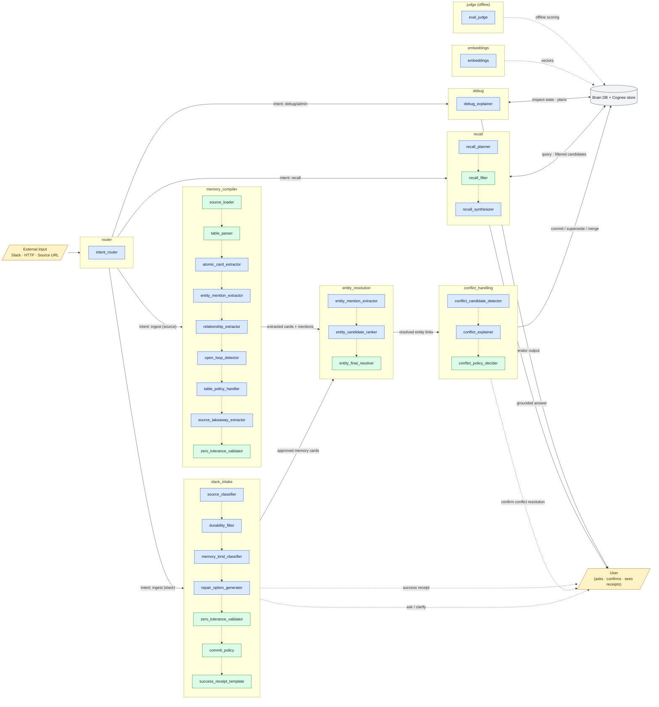

# Brain Flow Diagrams

This document contains two related but different views of Brain:

1. **Current runtime flow** - what the application code executes today.
2. **Fine-grained role topology** - the model/eval capability map declared in
   `brain_model_registry.yaml`.

The fine-grained topology is useful for model evaluation and deployment
planning, but it is not a literal runtime call graph. Current production
runtime is mostly deterministic. The only normal runtime LLM hooks are:

- an optional Slack proposal model when `SlackMemoryAgent` is constructed with
  an injected `llm_client`
- an optional broad memory compiler fallback when `BRAIN_LLM_ENABLED=true` and
  deterministic rule compilation is not already high-confidence

## Current Runtime Flow

Source of truth: `src/memory_stack/brain_service.py`,
`src/memory_stack/slack_memory_agent.py`, `src/memory_stack/ingestion/*`,
`src/memory_stack/resolution/*`, and `src/memory_stack/recall/*`.

```mermaid
flowchart LR
    classDef det fill:#dcfce7,stroke:#15803d,color:#08331a;
    classDef opt fill:#e0f2fe,stroke:#0369a1,color:#082f49;
    classDef store fill:#f3f4f6,stroke:#374151,color:#111827;
    classDef ext fill:#fef3c7,stroke:#a16207,color:#3f2d05;

    USER[/"User or client"/]:::ext
    SLACK[/"Slack events<br/>commands<br/>interactions"/]:::ext
    HTTP[/"HTTP or MCP tools"/]:::ext
    DB[("Brain DB")]:::store
    COGNEE[("Cognee projection")]:::store

    SLACK --> SAUTH[verify Slack signature<br/>allowlists]:::det
    SAUTH --> SPARSE[parse Slack intent]:::det
    SPARSE --> SREMEMBER[remember / confirm]:::det
    SPARSE --> SREAD[recall / profile / open loops / debug]:::det

    SREMEMBER --> SPROPOSE[proposal + guardrails<br/>dry run + confirmation]:::det
    SPROPOSE -. "optional injected LLM" .-> SLLM[Slack proposal model]:::opt
    SPROPOSE --> REMEMBER[brain_service.remember]:::det

    HTTP --> HROUTE[FastAPI endpoint<br/>MCP tool dispatch]:::det
    HROUTE --> REMEMBER
    HROUTE --> INGEST[brain_service.ingest_source]:::det
    HROUTE --> RECALL[brain_service.recall]:::det
    HROUTE --> ADMIN[get / profile / review<br/>undo / resolve / sync]:::det

    INGEST --> TOREMEMBER[build RememberRequest]:::det
    TOREMEMBER --> REMEMBER

    REMEMBER --> COMPILE[compile_memory]:::det
    COMPILE --> RULES[rule_compiler<br/>classify + create candidates]:::det
    RULES -. "if enabled and rules are not high-confidence" .-> CLLM[broad LLM compiler fallback]:::opt
    RULES --> RUN[create ingestion run]:::det
    CLLM --> RUN

    RUN --> UPSOURCE[upsert source<br/>mark Cognee pending]:::det
    RUN --> UPMEM[upsert memory card]:::det
    UPMEM --> ENT[resolve + link entities]:::det
    ENT --> REL[create relationships<br/>open loops]:::det
    REL --> CONFLICT[detect/apply duplicate<br/>supersession/conflict rules]:::det
    CONFLICT --> PENDING[mark Cognee pending/stale<br/>finish run + receipt]:::det
    UPSOURCE --> DB
    PENDING --> DB
    PENDING -. "out-of-band sync" .-> COGNEE

    SREAD --> RECALL
    RECALL --> MODE[infer recall mode]:::det
    MODE --> RETRIEVE[search Brain DB<br/>optional Cognee hydration]:::det
    RETRIEVE --> FILTER[status visibility filter]:::det
    FILTER --> ANSWER[build facts/evidence<br/>render templated answer]:::det
    ANSWER --> DBLOG[log recall]:::det
    DBLOG --> DB
    ANSWER --> USER

    ADMIN --> DB
    ADMIN -. "sync/rebuild" .-> COGNEE
```

## Runtime Notes

1. **Routing is deterministic.** HTTP requests are dispatched by FastAPI routes
   and MCP tool names. Slack requests are dispatched by command/event parsing.
   The runtime does not call a fine-grained `intent_router` model.
2. **Compilation is deterministic first.** `compile_memory` calls the rule
   compiler first. A broad LLM compiler can run only when LLMs are enabled and
   the rule result is not already sufficient high-confidence.
3. **Fine-grained extractor roles are not separate runtime calls.** Roles such
   as `atomic_card_extractor`, `entity_mention_extractor`,
   `relationship_extractor`, `open_loop_detector`, and
   `source_takeaway_extractor` are currently represented by deterministic rule
   compiler behavior, or by the optional broad compiler fallback.
4. **Memory cards are written before conflict handling.** Runtime writes the
   memory card, resolves and links entities, creates relationships/open loops,
   then runs deterministic duplicate/conflict/supersession handling.
5. **Recall is deterministic.** Recall mode inference, retrieval, status
   filtering, evidence construction, and answer rendering are code paths, not a
   fine-grained `recall_synthesizer` model call.
6. **Eval and embeddings remain model-backed outside this flow.** `eval_judge`
   is used by eval tooling. Embedding models are used when vector/Cognee paths
   are enabled.

## Runtime Role Status

| Role | Current runtime status |
| --- | --- |
| `intent_router` | Deterministic route/command parsing |
| `source_classifier` | Deterministic heuristics |
| `durability_filter` | Deterministic guardrails / rule sufficiency |
| `memory_kind_classifier` | Deterministic classification |
| `repair_option_generator` | Default deterministic; only model-based if an injected Slack LLM client is provided |
| `atomic_card_extractor` | Deterministic rule compiler by default; optional broad compiler LLM fallback, not a separate role |
| `entity_mention_extractor` | Deterministic from compiled card entities by default; optional broad compiler fallback |
| `relationship_extractor` | Deterministic from rule compiler by default; optional broad compiler fallback |
| `open_loop_detector` | Deterministic rules |
| `table_policy_handler` | Deterministic table handling |
| `source_takeaway_extractor` | Deterministic source summary/card creation by default; optional broad compiler fallback |
| `entity_candidate_ranker` | Not a runtime model role; entity resolution is deterministic |
| `entity_final_resolver` | Deterministic |
| `conflict_candidate_detector` | Deterministic duplicate/regex conflict detection |
| `conflict_explainer` | Not model-backed at runtime |
| `conflict_policy_decider` | Deterministic code / explicit user action |
| `recall_planner` | Deterministic mode inference |
| `recall_filter` | Deterministic status filtering |
| `recall_synthesizer` | Deterministic templated rendering |
| `debug_explainer` | Deterministic DB inspection at runtime |
| `eval_judge` | Model-based in eval tooling only |
| `embeddings` | Embedding-model based when vector/Cognee paths are used |

## Fine-Grained Role Topology

### Legend

- **model** (blue) — fine-grained role backed by an LLM
- **det** (green) — deterministic policy / validator
- **solid arrows** — intended information flow between coarse capabilities
- **dotted arrows** — intended ordering inside a coarse capability
- **dashed arrows** — out-of-band / supporting roles

Source of truth: `brain_model_registry.yaml` (`fine_grained_capabilities`,
lines 71-145).

### How to Read the Topology

1. **This is a registry/eval topology.** The diagram shows how coarse
   capabilities decompose into fine-grained roles for model evaluation and
   deployment decisions. It should not be read as the exact runtime call graph.
2. **The intended pattern is model proposes, deterministic policy enforces.**
   Fine-grained model roles recommend extraction, classification, or synthesis;
   deterministic roles validate or gate the result.
3. **Ingestion capabilities conceptually converge.** In this topology,
   `slack_intake` and `memory_compiler` produce candidate memory cards and
   entity mentions, which flow through `entity_resolution` and then
   `conflict_handling`.
4. **Recall is represented as planner/filter/synthesizer.** In current runtime
   this is deterministic mode inference, deterministic filtering, and templated
   answer rendering.
5. **User loop.** The user is involved at three points: clarification
   (`repair_option_generator`), conflict confirmation, and final receipts /
   answers.
6. **Out-of-band.** `embeddings` supplies vectors to the store when projection
   paths are enabled; `judge` runs offline against eval fixtures and is not on
   the normal runtime path.

### Coarse → fine-grained mapping (canonical)

| Coarse role        | Model roles                                                                                                                     | Deterministic roles                                                       |
| ------------------ | ------------------------------------------------------------------------------------------------------------------------------- | ------------------------------------------------------------------------- |
| router             | intent_router                                                                                                                   | —                                                                         |
| slack_intake       | source_classifier, durability_filter, memory_kind_classifier, repair_option_generator                                           | zero_tolerance_validator, commit_policy, success_receipt_template         |
| memory_compiler    | atomic_card_extractor, entity_mention_extractor, relationship_extractor, open_loop_detector, table_policy_handler, source_takeaway_extractor | table_parser, source_loader, zero_tolerance_validator         |
| entity_resolution  | entity_mention_extractor, entity_candidate_ranker                                                                               | entity_final_resolver                                                     |
| conflict_handling  | conflict_candidate_detector, conflict_explainer                                                                                 | conflict_policy_decider                                                   |
| recall             | recall_planner, recall_synthesizer                                                                                              | recall_filter                                                             |
| debug              | debug_explainer                                                                                                                 | —                                                                         |
| judge (offline)    | eval_judge                                                                                                                      | —                                                                         |
| embeddings         | embeddings                                                                                                                      | —                                                                         |
